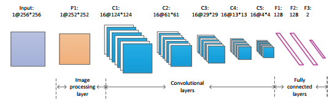
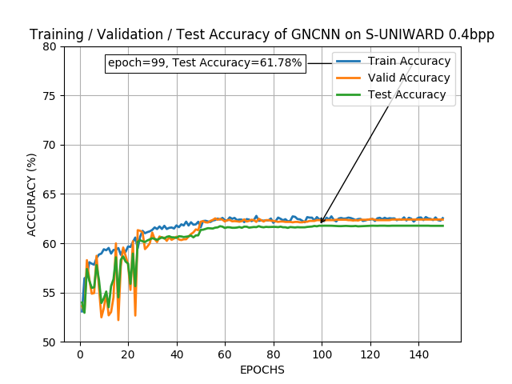

# Pytorch implementation of GNCNN
Pytorch implementation of [GNCNN: Deep Learning for Steganalysis via Convolutional Neural Networks](https://www.spiedigitallibrary.org/conference-proceedings-of-spie/9409/94090J/Deep-learning-for-steganalysis-via-convolutional-neural-networks/10.1117/12.2083479.full?SSO=1) - Qian et al.

The model train/validation/test accuracy has also been plotted when training on S-UNIWARD 0.4bpp.

<table>
  <tr>
    <td align="center">GNCNN</td>
     <td align="center">Train/Valid/Test Accuracy</td>
    
  </tr>
  <tr>
    <td valign="top"></td>
    <td valign="top"></td>
  </tr>
 </table>
